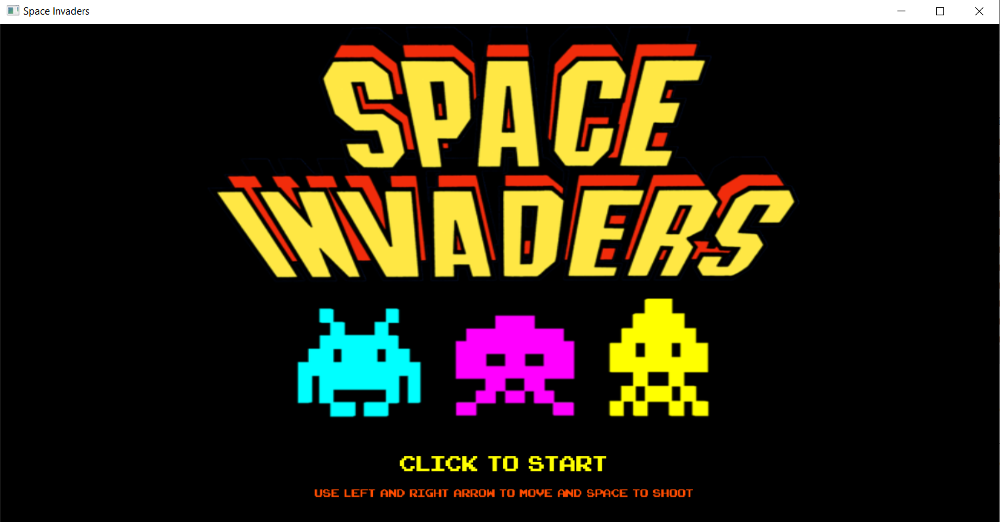
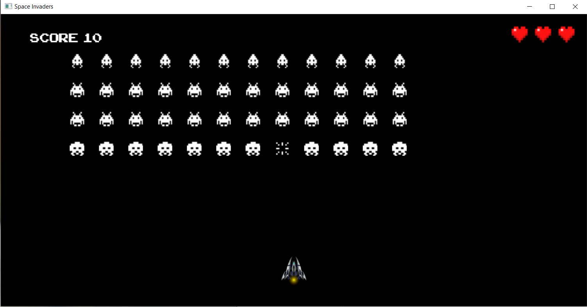
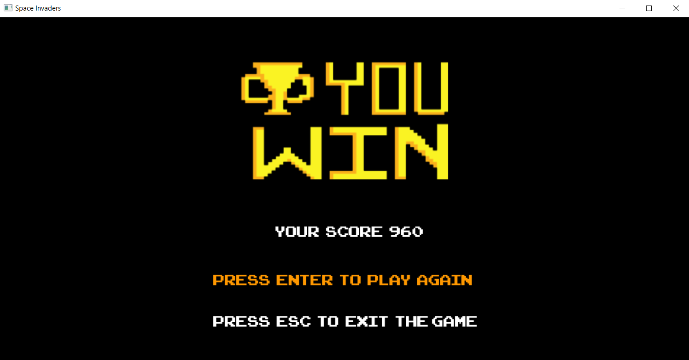
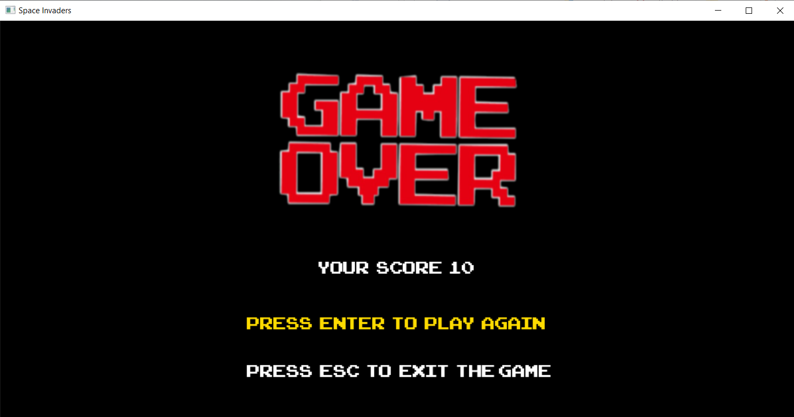

# Space Invaders
Space Invaders is a 2d game that i created in the course of programming with c++. The game uses the sgg library which has been created by the course instructor and his assistants. More information about the library you can find **[here](https://cgaueb.github.io/sgg/index.html)**.
The game consists of 3 screens.
## 1. The Starting Screen 
The Starting Screen contains instructions on how to play the game and when you click you move to the Playing Screen.  

## 2. The Playing Screen
The Starting Screen is the the screen on which the game is played.

## 3. The Result Screen 
The Result Screen contains 2 outcomes. You either win or lose. The Result Screen also gives you 2 choices, to exit the game or to play again.

## How to play the game
1. You can open the project with visual studio and run the solution.    
2. You can just click to Tutorial.exe file that is located to the bin folder.

